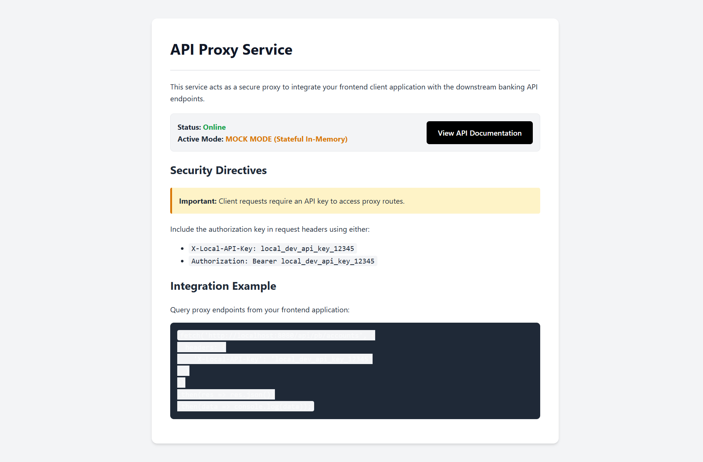
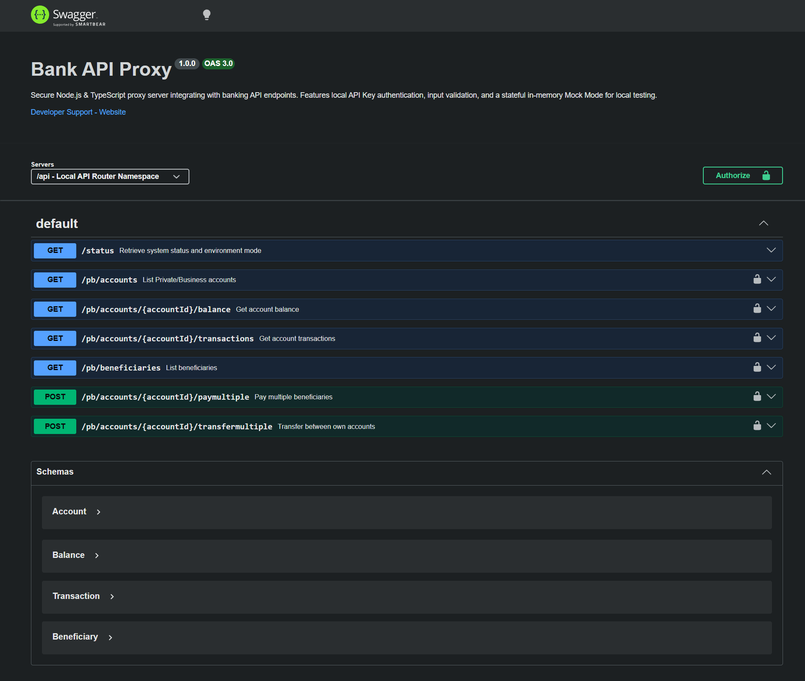

# Secure Bank API Proxy

A secure Node.js, Express, and TypeScript API proxy server designed to facilitate safe integration between frontend React/Next.js client applications and banking API endpoints.

This middleware protects your sensitive developer credentials from exposure to the frontend, manages the OAuth token lifecycle in-memory, validates input requests using Zod schemas, and exposes an interactive Swagger UI for testing.

---

## Features

- **Security First**: 
  - Downstream credentials are loaded securely via server-side environment variables and never exposed to the client application.
  - Implements local authorization (`X-Local-API-Key` header or standard Bearer authorization) to restrict access to proxy routes.
  - Registers secure HTTP headers via Helmet, manages CORS origin policies, and implements request rate limiting.
- **OAuth Token Management**: Handles identity server authorization requests automatically, caching access tokens securely in-memory and auto-refreshing them before expiration.
- **Stateful Mock Mode**: Includes an in-memory state engine. If client credentials are not supplied, the server falls back to mock mode. Executing mock transfers or beneficiary payments dynamically alters balance records and transaction logs in-memory.
- **Interactive Documentation**: Exposes interactive Swagger/OpenAPI documentation directly under the `/docs` route.

---

## Visual Walkthrough

### 1. Developer Control Panel


### 2. Interactive Swagger UI


---

## Directory Structure

```
.
├── src/
│   ├── config/
│   │   └── env.ts            # Environment schema parser using Zod
│   ├── middleware/
│   │   ├── auth.ts           # Access key validation middleware
│   │   ├── logging.ts        # Request logger with PII masking
│   │   ├── validation.ts     # Request body schema validator
│   │   └── error.ts          # Central error handling
│   ├── services/
│   │   └── bank.ts           # Client service and mock engine
│   ├── controllers/
│   │   ├── accounts.ts       # Account, balance, and transaction handlers
│   │   ├── transfers.ts      # Beneficiary, payment, and transfer handlers
│   │   └── mock.ts           # Dynamic mock data & webhook simulator
│   ├── routes/
│   │   ├── index.ts          # Root API router namespace
│   │   ├── accounts.ts       # Account routes mounting
│   │   ├── transfers.ts      # Transfer/payment routes mounting
│   │   └── mock.ts           # Mock management routes mounting
│   ├── swagger/
│   │   └── swagger.json      # OpenAPI 3.0 configuration definition
│   └── app.ts                # Express application bootstrapping
├── docs/
│   └── screenshots/          # System walkthrough screenshots
├── .env                      # Active local configurations (ignored by git)
├── .env.example              # Environment variables template
├── tsconfig.json             # TypeScript compiler settings
├── package.json              # Project script and dependency mappings
└── README.md                 # Project integration guide
```

---

## Installation & Setup

### 1. Clone & Install Dependencies
```bash
npm install
```

### 2. Environment Configuration
Create a `.env` file in the project root:
```ini
# Server Settings
PORT=8080
NODE_ENV=development

# Security Settings
# Define the secret key required by your client/frontend to call this proxy
LOCAL_API_KEY=local_dev_api_key_12345
ALLOWED_ORIGINS=http://localhost:3000

# Downstream API Settings
# Set to 'mock' to run locally using the stateful in-memory mock engine
TARGET_ENV=mock

# Downstream Credentials (required when TARGET_ENV is sandbox or production)
CLIENT_ID=your_client_id_here
CLIENT_SECRET=your_client_secret_here
API_KEY=your_api_key_here
```

### 3. Run the Proxy
- **Development Mode** (Hot-reloads on file edits):
  ```bash
  npm run dev
  ```
- **Production Mode** (Compiles and runs ES build):
  ```bash
  npm run build
  npm start
  ```

---

## Endpoint Specification

Once the server is running, visit **[http://localhost:8080/docs](http://localhost:8080/docs)** to test the routes using Swagger UI.

### Authorization Header
Add the `X-Local-API-Key` or `Authorization: Bearer <key>` header using your configured `LOCAL_API_KEY` (default is `local_dev_api_key_12345`) to authenticate calls.

| Method | Route | Description | Auth Required |
| :--- | :--- | :--- | :--- |
| **GET** | `/api/status` | System health check and runtime mode details | No |
| **GET** | `/api/pb/accounts` | Fetch all active bank accounts | Yes |
| **GET** | `/api/pb/accounts/:accountId/balance` | Query current and available balance | Yes |
| **GET** | `/api/pb/accounts/:accountId/transactions` | Query transaction records (optional filters) | Yes |
| **GET** | `/api/pb/beneficiaries` | Fetch pre-approved EFT beneficiaries | Yes |
| **POST** | `/api/pb/accounts/:accountId/paymultiple` | Submit payments to beneficiaries | Yes |
| **POST** | `/api/pb/accounts/:accountId/transfermultiple` | Execute inter-account transfers | Yes |
| **POST** | `/api/pb/accounts/:accountId/pay-direct` | Pay pre-approved beneficiary directly by account number | Yes |
| **POST** | `/api/mock/accounts` | Dynamically register custom mock account (Mock Mode) | No |
| **POST** | `/api/mock/beneficiaries` | Dynamically register custom mock beneficiary (Mock Mode) | No |
| **POST** | `/api/mock/webhook/register` | Register webhook endpoint for swipe notifications (Mock Mode) | No |
| **POST** | `/api/mock/trigger-swipe` | Simulate card swipe, deduct balance, log transaction, fire webhook (Mock Mode) | No |

---

## Frontend Integration Example (React/Next.js)

To consume this API securely, direct your Next.js application calls to the proxy server instead of the direct bank API, passing your local authorization key:

```tsx
import React, { useEffect, useState } from 'react';

export default function AccountList() {
  const [accounts, setAccounts] = useState([]);
  const [loading, setLoading] = useState(true);

  useEffect(() => {
    fetch('http://localhost:8080/api/pb/accounts', {
      headers: {
        'X-Local-API-Key': 'local_dev_api_key_12345',
        'Content-Type': 'application/json'
      }
    })
      .then(res => {
        if (!res.ok) throw new Error('Authorization failed');
        return res.json();
      })
      .then(payload => {
        setAccounts(payload.data.accounts);
        setLoading(false);
      })
      .catch(err => {
        console.error(err);
        setLoading(false);
      });
  }, []);

  if (loading) return <p>Loading accounts...</p>;

  return (
    <div>
      <h2>Bank Accounts</h2>
      <ul>
        {accounts.map((acc: any) => (
          <li key={acc.accountId}>
            <strong>{acc.referenceName}</strong> - {acc.accountNumber} ({acc.productName})
          </li>
        ))}
      </ul>
    </div>
  );
}
```

---

## Mock Mode & Webhook Simulation Guide

To facilitate seamless local developer loops without relying on pre-linked sandbox IDs, you can use the proxy's dynamic mock data registry and card-swipe webhook simulator.

### 1. Dynamic Mock Data Registration

You can populate the in-memory state engine at startup or during test initialization:

- **Register a Mock Account:**
  ```http
  POST /api/mock/accounts
  Content-Type: application/json

  {
    "accountId": "892019481720",
    "accountNumber": "20087654321",
    "accountName": "Investec Private Cash",
    "referenceName": "Transaction Account",
    "productName": "Private Cash Account",
    "accountType": "private",
    "initialBalance": 1000.00
  }
  ```

- **Register a Mock Beneficiary:**
  ```http
  POST /api/mock/beneficiaries
  Content-Type: application/json

  {
    "beneficiaryId": "ben_charity_imbumba",
    "accountNumber": "98765432101",
    "code": "250655",
    "bank": "Standard Bank",
    "beneficiaryName": "Imbumba Foundation",
    "paymentType": "Electronic EFT"
  }
  ```

---

### 2. Intelligent Beneficiary Resolution (`/pay-direct`)

Client applications (like GivingIsLekker) can make direct payments utilizing raw account numbers:

```http
POST /api/pb/accounts/892019481720/pay-direct
X-Local-API-Key: local_dev_api_key_12345
Content-Type: application/json

{
  "accountNumber": "98765432101",
  "amount": "2.50",
  "myReference": "RoundUp Donation",
  "theirReference": "RoundUp Contrib"
}
```

The proxy will search active beneficiaries (mock or live based on environment mode), resolve the correct `beneficiaryId` (e.g. `ben_charity_imbumba`), and automatically execute the `paymultiple` transfer. If the beneficiary is not pre-approved on the profile, it returns:

```json
{
  "error": "BENEFICIARY_NOT_APPROVED",
  "message": "Beneficiary with account number 98765432101 is not pre-approved on your Investec profile."
}
```

---

### 3. Webhook Simulation Engine

Enable real-time transaction notification testing by registering your local client webhook:

- **Register Webhook Endpoint:**
  ```http
  POST /api/mock/webhook/register
  Content-Type: application/json

  {
    "webhookUrl": "http://localhost:3000/api/investec/webhook"
  }
  ```

- **Simulate a Card Swipe:**
  Triggering a swipe will deduct the amount from the mock account's balance, log a `DEBIT` transaction under the account's history, and fire a transaction event to the registered webhook:
  ```http
  POST /api/mock/trigger-swipe
  Content-Type: application/json

  {
    "accountId": "892019481720",
    "amount": 42.50,
    "merchant": "Woolworths Cape Town"
  }
  ```

- **Webhook Event Structure Dispatched:**
  The webhook receiver receives the standard Investec Programmable Card webhook payload:
  ```json
  {
    "accountId": "892019481720",
    "cardId": "card_pb_mock_1",
    "centsAmount": "4250",
    "currencyCode": "zar",
    "merchant": {
      "name": "Woolworths Cape Town",
      "category": "5411",
      "city": "Cape Town",
      "country": "ZA"
    },
    "amount": 42.50,
    "dateTime": "2026-05-30T10:30:00.000Z",
    "reference": "Woolworths Cape Town",
    "type": "debit",
    "status": "success"
  }
  ```

